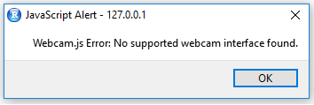

# shinywebcam

_Basic integration of webcamjs into R shiny, to open the webcam, show the webcam output and make snapshots._

## About Webcamjs
This package is an integration of [jhuckaby's webcamjs](https://github.com/jhuckaby/webcamjs), an HTML5 Webcam Image Capture Library with Flash Fallback.

## Installation
To install, run:

``` 
if (!require(devtools)) {
  install.packages('devtools')
}
devtools::install_github('Emelieh21/shinywebcam')
```

## Usage
For usage, see example app:

```
library(shiny)
library(shinywebcam)

ui <- fluidPage(
  startWebcam(width = 320, height = 240, quality = 100),
  snapshotButton(),
  takeSnapshot()
)
server <- function(input, output){}
shinyApp(ui,server)
```

Launching this shiny app, you'll probably see the following error popping up in the viewer:



This is normal. The webcam only works from the browser. Click "OK" and "Open in browser". You should now be asked whether you allow the running shiny app to use your camera:


After allowing, the webcam output should start to show. Pressing the "Take Snapshot" button makes a snapshot appear below.

> To do:
>
> * Figure out whether it is possible to move the webcam output/snapshot to different places on the screen
> * Make it possible to "capture" the snapshot and do something with it in the server